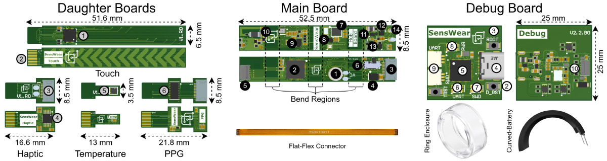

<div align="center">

# SensWear

### An open, modular, and AI-ready wearable research platform

[Website](https://sens-wear.com) ·
[Repositories](https://github.com/orgs/Sens-Wear/repositories) ·
[Contact](mailto:contact@sens-wear.com)

[](https://opensource.org/licenses/MIT)
[](https://sens-wear.com)



</div>

## Open wearable infrastructure for research and prototyping

SensWear is a research-grade wearable electronics platform for physiological sensing, embedded AI, multimodal data collection, and rapid hardware experimentation. Its modular architecture separates the wearable form factor from sensing, actuation, firmware, and data interfaces, allowing the same technology stack to support smart rings, wristbands, patches, and custom research devices.

The platform combines a compact flexible main board, interchangeable daughter boards, low-power Zephyr-based firmware, Bluetooth connectivity, and software tools for acquiring and working with raw, time-synchronized sensor data. Researchers can reconfigure modalities such as PPG, motion, temperature, capacitive touch, haptics, and visual feedback without rebuilding the complete system.

SensWear is intended to make wearable research more transparent, reproducible, and extensible—from the PCB and embedded software to mobile applications and analysis pipelines.

## The SensWear stack

| Repository | Purpose |
| --- | --- |
| [Hardware](https://github.com/Sens-Wear/hardware-v1) | Schematics, PCB layouts, manufacturing resources, mechanical references, and designs for the flexible main board, sensor daughter boards, and debug hardware. |
| [MobileApp](https://github.com/Sens-Wear/MobileApp) | The companion mobile application for discovering SensWear devices, configuring sessions, communicating over Bluetooth, and viewing or recording sensor data. |
| [Firmware](https://github.com/Sens-Wear/firmware) | Zephyr-based embedded software, board definitions, sensor drivers, Bluetooth services, synchronized acquisition, local logging, and low-power device operation. |
| [Python SDK](https://github.com/Sens-Wear/python-sdk) | Python tools for connecting to the platform, collecting and decoding data, automating experiments, and integrating SensWear with scientific analysis and machine-learning workflows. |
| [TypeScript SDK](https://github.com/Sens-Wear/typescript-sdk) | TypeScript interfaces for building web, desktop, and Node.js applications that communicate with SensWear devices and consume their data streams. |

Together, these repositories provide an inspectable path from physical sensing to embedded processing, user-facing applications, and research analysis.

## Research and citation

SensWear is being developed as reusable infrastructure for wearable computing, physiological sensing, edge AI, and human-centered research. If the platform supports your published work, please cite the platform paper. Until the final publication metadata is available, use the following citation for the manuscript submitted to UbiComp/ISWC 2026:

```bibtex
@unpublished{salami2026senswear,
  author = {Dariush Salami and Behzad Salami and Huseyin Yigitler},
  title  = {{SensWear}: An Open, Modular, and {AI}-Ready Wearable Platform},
  note   = {Manuscript submitted to UbiComp/ISWC 2026},
  year   = {2026},
  url    = {https://sens-wear.com}
}
```

## Contributing

SensWear is an open-source project, and contributions are welcome across hardware, firmware, mobile development, SDKs, documentation, testing, sensor integration, power optimization, and embedded machine learning. Start by opening an issue in the relevant repository to discuss a proposal, or submit a focused pull request with a clear description and validation notes.

By contributing improvements, examples, integrations, and experimental results, you help make open wearable research easier to reproduce and extend across laboratories and products.

## Partnerships and research collaboration

We welcome collaboration with universities, research groups, companies, and other organizations working in wearable computing, digital health, sensing, embedded intelligence, and related fields. For joint research, platform evaluation, teaching, integration, or partnership opportunities, contact [contact@sens-wear.com](mailto:contact@sens-wear.com).

Learn more about the platform at [sens-wear.com](https://sens-wear.com).

## License

SensWear is released under the permissive [MIT License](https://opensource.org/licenses/MIT), enabling use, modification, distribution, and commercial development subject to the license terms. Refer to the `LICENSE` file in each repository for the applicable copyright notice.

## Research-use notice

SensWear is a research and prototyping platform. It is not a medically certified device and must not be used for clinical diagnosis or treatment without the validation, approvals, and controls required for the intended use.

<div align="center">

**Open hardware. Embedded intelligence. Modular by design.**

</div>
